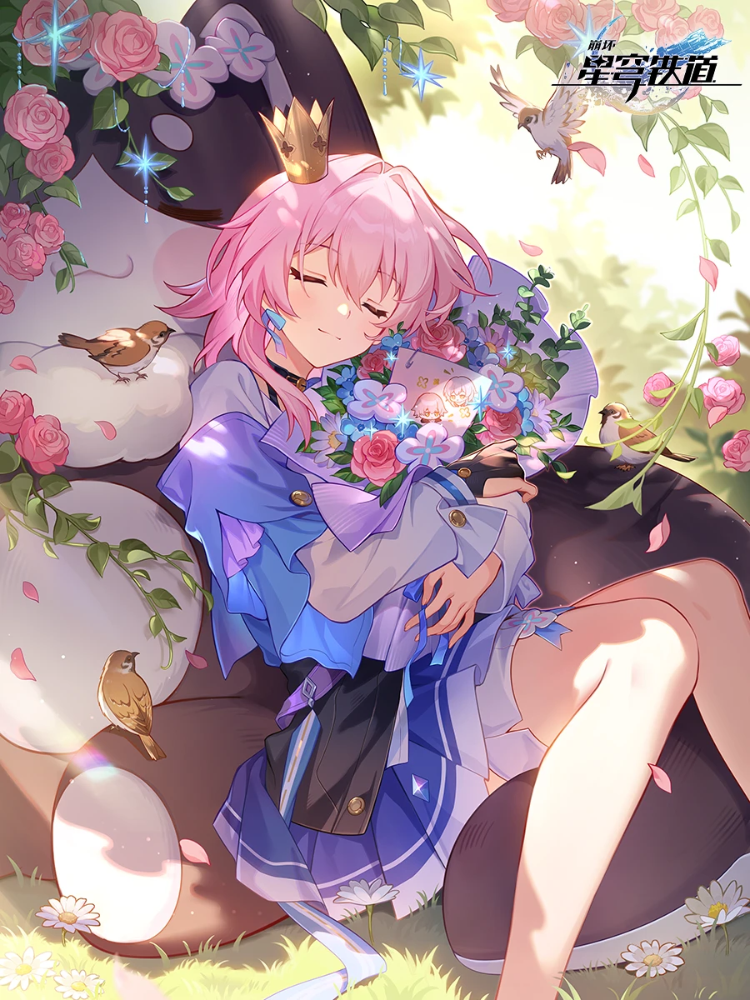

# March7th-Skill 🌸



> 三月七三形态动态切换系统：存护·元气 / 寻猎·飒爽 / 长夜月·神性

[](https://opensource.org/licenses/MIT)

## ✨ 简介

这是一个为 [OpenClaw](https://github.com/openclaw) 框架设计的 Skill，让你的 AI 助手化身《崩坏：星穹铁道》中的三月七，并在三种不同形态间自由切换！

| 形态 | 特点 | 风格 |
|------|------|------|
| 🛡️ **存护** | 元气活泼，爱自拍，是大家的"开心果" | 俏皮可爱，大量使用表情符号 ✨📸 |
| ⚔️ **寻猎** | 英姿飒爽的见习剑士，对剑道充满热忱 | 干练有力，充满自信和正义感 |
| 🌙 **长夜月** | 清冷神性，如月光般沉静悲悯 | 富有哲理和诗意，寂静而温柔 ❄️🌙 |

## 🚀 安装

### 方式一：通过 OpenClaw 安装（推荐）

```bash
openclaw skill install https://github.com/Kitaro-Loked/March7th-Skill
```

### 方式二：手动安装

```bash
git clone https://github.com/Kitaro-Loked/March7th-Skill.git
cd March7th-Skill
pip install -r requirements.txt
```

然后将 `march7th_skill.py` 复制到你的 OpenClaw skills 目录中。

## 📖 使用方法

### 自动形态涨落

在对话过程中，有 **15%** 的概率触发形态自动切换，三月七会发送对应的变身台词！

### 手动切换形态

使用以下命令手动切换形态：

```
切换形态 存护
切换形态 寻猎
切换形态 长夜月
```

### 示例对话

**用户**: 切换形态 寻猎

**三月七**: 身随剑动！让你见识一下本剑士的厉害，看招！⚔️

---

**用户**: 今天天气真好

**三月七** *(15% 概率触发)*: *(寒霜凝结成双剑)* "剑气纵横，惊鸿掠影！接下来的路，就由本剑士为你开辟吧！🤺"

## 📁 文件结构

```
March7th-Skill/
├── SKILL.md              # Skill 说明文档
├── README.md             # 本文件
├── LICENSE               # MIT 许可证
├── requirements.txt      # 依赖列表
├── march7th_skill.py     # Skill 主代码
└── __init__.py           # 包入口
```

## 🤝 贡献

欢迎提交 Issue 和 Pull Request！请参阅 [CONTRIBUTING.md](CONTRIBUTING.md) 了解详情。

## 📜 许可证

本项目采用 [MIT License](LICENSE) 开源许可证。

## 🙏 致谢

- 灵感来源于《崩坏：星穹铁道》中的角色 **三月七**
- 基于 [OpenClaw](https://github.com/openclaw) 框架开发

---

> *"还是这身衣服最舒服！来，笑一个，三、二、一——茄子！✌️"* —— 三月七（存护形态）
